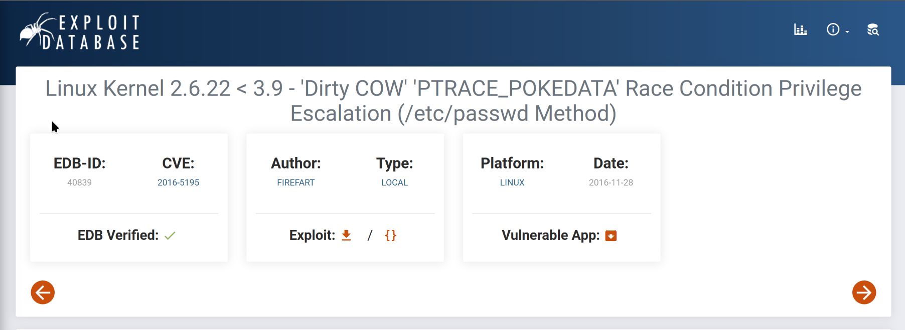

# Exploit kernel

### Search kernel vulnerability

```
uname -a 
Linux BornToSecHackMe 3.2.0-91-generic-pae #129-Ubuntu SMP Wed Sep 9 11:27:47 UTC 2015 i686 athlon i386 GNU/Linux
```



## Dirty COW vulnerability (CVE-2016-5195)

The Dirty COW exploit is a critical vulnerability in the Linux kernel, allowing a local attacker to modify read-only files and gain elevated privileges (root) on a compromised system. The vulnerability was discovered in 2016 and has affected many versions of Linux kernels.

### Exploitability

Access required: The attacker must have local access to the machine (normal user account or physical access to the system).

Privileges required: No special privileges are required prior to the attack; the attacker can be an unprivileged user.

### Attack details

The attacker exploits a race condition to force the kernel to write to protected memory areas, allowing modification of critical system files (e.g. /etc/passwd) or other sensitive data. This can allow the attacker to :

- Add a user with root privileges.
- Change existing user passwords.
- Bypass access controls and gain full control of the system.

### Conclusion

The Dirty COW exploit allows a local attacker to modify sensitive system files by exploiting a vulnerability in the Linux kernel's Copy-On-Write mechanism. The fix was released in 2016, but until the system is updated, it remains vulnerable to elevation of privileges.

### Exploit on the machine
